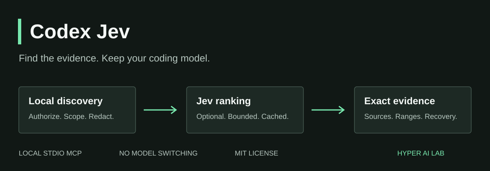

<p align="center"></p>

# Codex Jev

**Find the evidence. Keep your coding model.**

[](https://github.com/Hyper-AI-Lab/codex-jev/actions/workflows/ci.yml)
[](LICENSE)
[](docs/STATUS.md)
[](docs/ARCHITECTURE.md)

Large repositories and noisy logs can fill a coding session with material it
doesn't need. Codex Jev adds a retrieval layer: find candidate evidence locally,
optionally rank sanitized excerpts with TypeSafe's Jev, and return bounded,
source-addressed evidence with exact follow-up reads.

**It does not replace your coding model, proxy inference, rewrite conversation
history, or bypass Codex usage limits.** Works without a Jev key in local-only mode.

> Public beta. Offline safety and packaging tests pass; generalized Codex token,
> cost and speed savings are **not yet established**. Evidence-byte reduction is
> not an account-quota measurement. [What is verified](docs/STATUS.md).

## Why use it?

| Capability | What you get |
| --- | --- |
| Focused investigations | Query-prioritized code, tests, configuration and log evidence |
| Progressive disclosure | Concise previews, source hashes, line ranges and exact reads |
| Recoverable omissions | List retained, omitted and unscored candidates; inspect what was left out |
| Controlled spending | Local-only by default; explicit paid activation, persistent caps and reservations |
| Recovery boundaries | Private Git checkpoints, corruption checks and owner-acknowledged resume |
| Honest measurements | Separate Jev, cache, bypass and fallback statistics; missing usage stays unknown |

Best suited to multi-file investigations and large diagnostics. Precise file
reads, small edits, patches and test commands should keep using native tools.

## Quick start

Requirements: **Node 22.13+**, **Python 3.11+**, Git, ripgrep, and a Codex client
with stdio MCP support. Recovery hooks additionally require a hook-capable
Codex version. The tested deployment is a Linux execution host, including a
remote host used from the macOS Codex app. Mac-local execution is unverified.

Run on the host where Codex actually reads your project. Keep this checkout for
updates. The current development installer copies verified runtime artifacts to
a private content-addressed release; it no longer executes from this checkout.
The published beta tag below predates that installer change; check the closure
ledger for release and actual-connection verification before assuming activation.

```bash
git clone https://github.com/Hyper-AI-Lab/codex-jev.git
cd codex-jev
git checkout v0.4.0-beta.1
npm ci
npm run build
python3 runtime/manage.py install \
  --node "$(command -v node)" \
  --workspace /absolute/path/to/your/git-project \
  --codex-home "${CODEX_HOME:-$HOME/.codex}" \
  --entrypoint dist
```

The installer preserves your model, reasoning effort, authentication and unrelated
settings. It adds an owned MCP entry, concise global guidance and recovery hooks.
Existing conflicting configuration is rejected, not overwritten.

Reconnect the execution host or reload your Codex client so it reads the new MCP
configuration. Review the generated hooks in the native Hooks UI and authorize
them there. **Installation is not hook trust.** Continue the same task afterward.

Ask Codex:

```text
Check evidence_status. Use search_workspace_evidence to investigate how this
project loads configuration. Show source ranges, recover any relevant omissions,
and distinguish local results from actual Jev selection.
```

No paid requests occur from this quick start. To enable hosted ranking, follow
the explicit key, spending-cap and retention-validation steps in
[Installation](docs/INSTALLATION.md). The adapter is MIT-licensed; **the hosted
Jev service is separately billed**.

## Tools

| MCP tool | Purpose |
| --- | --- |
| `search_workspace_evidence` | Scoped workspace investigation with bounded candidate selection |
| `read_large_text_evidence` | Query-related ranges from an eligible text or log file |
| `list_evidence` | Paginate candidate references, including omissions and unscored ranges |
| `read_selected_evidence` | Read exact bounded ranges after hash and access revalidation |
| `evidence_status` | Loaded build, selection mode, budget, reservations and measurement coverage |
| `judge_evidence` | Advisory classification, checks and scores from exact local evidence; never action authorization |

The development installer also owns one global `codex-jev` skill. It guides
broad retrieval and useful semantic batches without mandatory paid hook calls.
Owner-edited or pre-existing skill files are preserved, not silently adopted.
See [judgment contracts](docs/JUDGMENTS.md) and the current
[selective-adoption ledger](docs/SELECTIVE_ADOPTION.md) for rollout status.

Selection currently bounds each request to 20 candidates, eight returned blocks
and 48 KiB outbound. Critical overflow is recoverable through pagination and exact
reads. Small packets bypass Jev; cache hits avoid a repeated paid call.
Not selected does **not** mean nonexistent.

## Safety and privacy

- Workspace authorization, Git exclusions, sensitive-path denial and local
  redaction apply before sending evidence. Source text remains untrusted data.
- Only bounded sanitized queries, requirements and excerpts go to TypeSafe,
  with opaque candidate identifiers, not full conversations or credential files.
- One in-flight Jev request, transactional reservations and conservative unknown
  charges protect shared budgets. Quota responses halt covered operations.
- Recovery verifies state before resuming; it never reapplies patches, repeats
  deployments or cancels unrelated processes automatically.
- Regex redaction is not perfect. Do not enable hosted ranking for data you
  cannot permit a third party to process. Provider retention is governed by
  [TypeSafe's policy](https://typesafe.ai/legal/privacy-policy).

Hooks are partial guards, not a security sandbox or universal interception layer.
Already-running commands and hard process failures need explicit reconciliation.
See [Security](SECURITY.md) and [Recovery](docs/RECOVERY.md).

## Documentation

[Installation and paid opt-in](docs/INSTALLATION.md) ·
[Architecture](docs/ARCHITECTURE.md) ·
[Recovery and rollback](docs/RECOVERY.md) ·
[Measurements and limitations](docs/STATUS.md) ·
[Contributing](CONTRIBUTING.md) ·
[Release notes](CHANGELOG.md)

## Development

```bash
npm ci
npm run check
python3 -m unittest discover -s runtime -p 'test_*.py' -q
python3 -m compileall -q runtime
```

The test suite uses synthetic fixtures and mocked providers; no API key, paid
Jev call or native Codex inference is required. Packaging tests exercise isolated
install, upgrade, rollback and uninstall without accessing real authentication.

## Credits

Built by [Hyper AI Lab](https://github.com/Hyper-AI-Lab), derived from
[James Cressler's Jev Codex Token Saver](https://github.com/jcressler/jev-codex-token-saver).
Upstream MIT copyright is preserved. [Full attribution](NOTICE.md).
Independent project; not an official OpenAI or TypeSafe product.

Useful to your team? Share a reproducible, sanitized investigation or contribute
a regression test. Correctness and transparent measurements matter more than
headline compression percentages.
