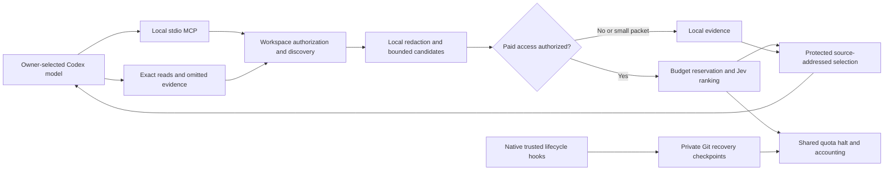

# Architecture

## Boundaries

`src/hardened-service.mjs` is the shared enforcement path for supported MCP, CLI
and validation entrypoints. Discovery and content indexes stay local. Git ignore
rules, sensitive-path exclusions, descriptor identity, content hashes and policy
identity are rechecked before disclosure. A query-prioritized shortlist is not an
exhaustive search; scan-limit notices are part of the response.

Jev scores supplied evidence, not the conversation. The coding model still
reasons, edits, tests and decides when another exact read is necessary. No
inference proxy or model-router is involved. The approach follows TypeSafe's
[shortlist-then-rerank guidance](https://docs.typesafe.ai/cookbooks/rerank_typesafe).

Each reference has a source hash, range and disposition. Protected exceptions,
constraints and query-related diagnostics are retained conservatively. Omitted
and unscored ranges remain addressable through `list_evidence`; exact reads reject
stale or newly unauthorized files. References are session-local and expire.

## State

Private state lives outside the project under the chosen Codex home:

- SQLite ledger: shared reservations, charges, cached selection decisions and
  bounded retrieval measurements. Unknown charges remain reserved.
- Recovery directories: checkpoint manifests, eligible file artifacts, separate
  staged/unstaged diffs, current task notes and unfinished operation references.
- Telemetry store, when enabled: allowlisted numeric values, hashed identifiers,
  bounded 30-day detail and compact historical aggregates; no prompt bodies.

Recovery artifacts can contain proprietary source even though credential-like
files/content are excluded. They are private, not public release or support data.

## Supported and unsupported claims

The primary supported transport is local stdio MCP. The public package is model
neutral, while an owner may explicitly choose an Astra-only policy. It does not
implement an alternative agent runtime, erase old context, guarantee subscription
savings, provide provider zero retention, or universally intercept native tools.
The historical `astra-context-v4` policy identifier is retained for evidence and
cache compatibility; it does not select a model.

Legacy evaluation helpers remain for regression tests, with old campaign mains
disabled. The capped native comparison is an explicit maintainer experiment,
not an install step or background job. It must never run automatically in CI.
